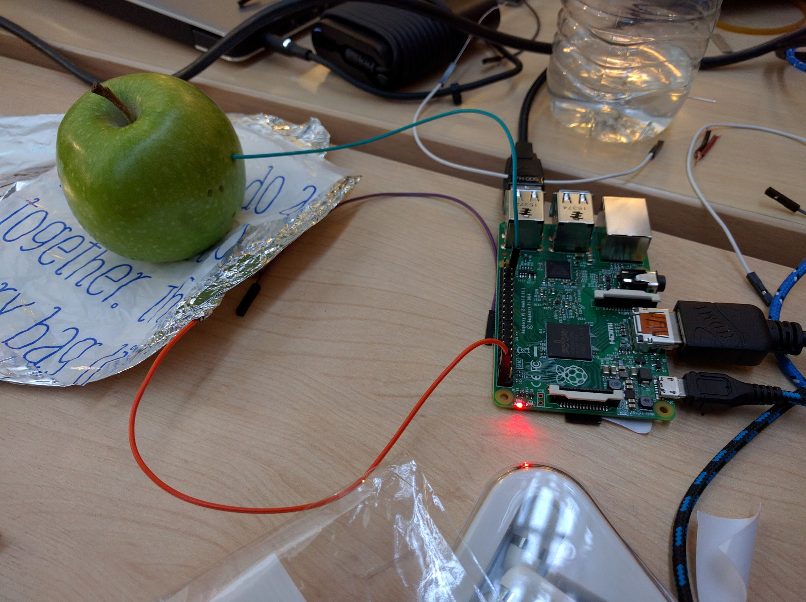
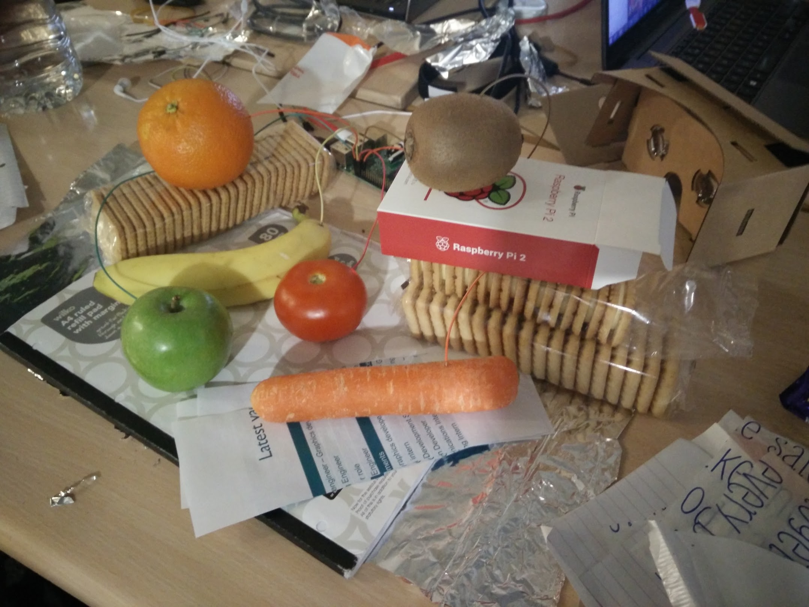
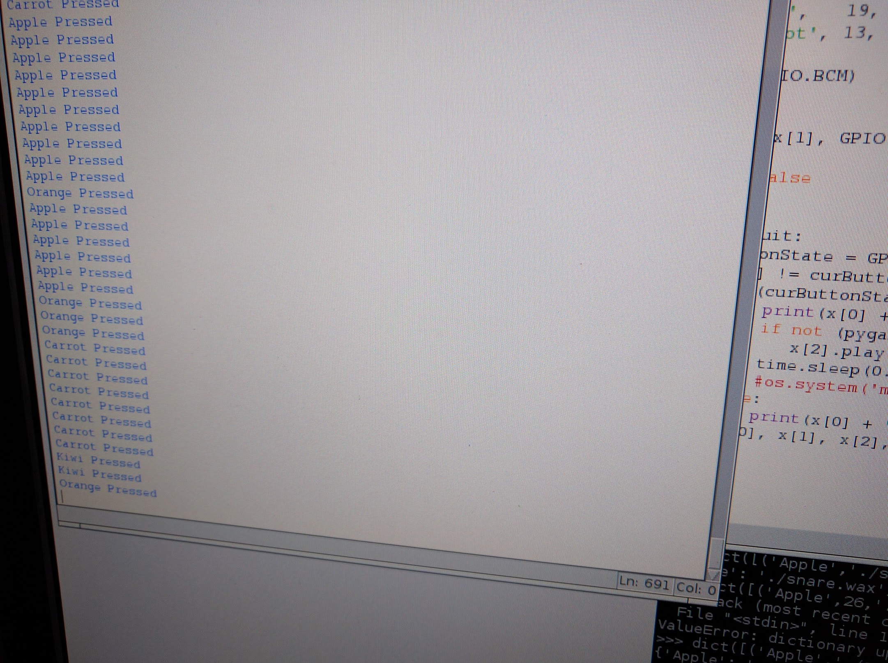

#TootyFrooty

A project attempting to use fruit as input devices for the Raspberry Pi.

We used very basic materials to charge up the fruit and then use the discharge upon touching as input for the device.
We programmed each fruit to make a different noise when touched.

#####Some Pictures

######The First Apple

######The Final Tooty Frooty Lineup

######Fruit Inputs Working

#####Notes

The [FrootyTooty.py](./FrootyTooty.py) file attempts to use one of the inputs as a toggle between soundboards, but is currently not working correctly.   [TootyFrooty.py](./TootyFrooty.py) works by taking in a set of sounds based on the word entered with the command, assuming that there is a sound for each fruit. This is working correctly and the code is relatively simple to look at and read.

#####Credits

Project worked on by: 
[Sean Innes](http://seaninn.es/) 
[Aleena Baig](https://uk.linkedin.com/in/aleenab) 
[Raef Coles](https://github.com/RcColes) 

Sounds from : 
[http://99sounds.org/drum-samples/](http://99sounds.org/drum-samples/) 
[https://www.freesound.org](https://www.freesound.org) 
[http://soundbible.com/](http://soundbible.com/) 
[http://www.orangefreesounds.com/](http://www.orangefreesounds.com/) 
[https://maps.djtechtools.com](https://maps.djtechtools.com) 
